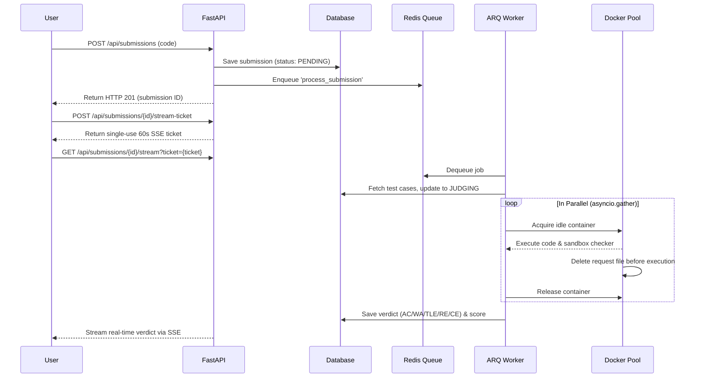

# Hello Bitcoin Architecture

This document provides a comprehensive overview of the Online Judge (OJ) architecture, detailing the technology stack, data flow, scaling capabilities, and the rationale behind critical architectural decisions.

## 1. System Overview & Technology Stack

The system is a distributed, multi-language Online Judge designed to evaluate untrusted code against hidden test cases safely and concurrently.

- **Web Framework**: **FastAPI** (Python)
  - *Why*: Provides high-throughput async capabilities, automatic OpenAPI validation, and extremely low latency for I/O bound tasks (like database queries and job dispatch).
- **Database**: **PostgreSQL** (Production) / **SQLite** (Development via `aiosqlite`)
  - *Why*: Built with SQLAlchemy's async ORM (`AsyncSession`), enabling seamless local SQLite development and high-concurrency PostgreSQL in production.
- **Message Broker & Queue**: **Redis + ARQ**
  - *Why*: ARQ is a high-performance asyncio job queue backed by Redis. It natively integrates with FastAPI's async event loop with minimal overhead.
- **Sandbox Engine**: **Docker API (docker-py)**
  - *Why*: Provides strong process isolation via Linux namespaces and cgroups. We use a warm container pool (`ContainerPool`) to avoid the ~1-second cold-start penalty per submission.

---

## 2. Request Lifecycle & Data Flow

When a user submits code, the system processes it asynchronously:



---

## 3. Key Architectural Decisions (The "Why")

### A. The Persistent Container Pool (`judge/pool.py`)
**Problem:** `docker run` takes 500ms to 1.5s to provision networking, mount file systems, and allocate cgroups.
**Solution:** We maintain a pool of long-running `sleep infinity` containers.
**Why:** When a job arrives, we use `docker exec` to run the payload inside an already-warm container. This reduces sandbox initialization latency from ~1000ms down to ~30ms.

### B. Async Message Queue (`ARQ`) vs Synchronous Execution
**Problem:** Code execution takes time (up to 5+ seconds per submission). If FastAPI waited for the result before responding, users would hold open HTTP connections, quickly exhausting server thread pools.
**Solution:** We decoupled the producer (FastAPI) and consumer (ARQ worker).
**Why:** The web server immediately returns `201 Created` with `PENDING` status. The frontend receives real-time updates via Server-Sent Events (SSE) using a secure, single-use stream ticket.

### C. Isolated Request Injection & In-Sandbox Checker
**Problem:** Passing expected answers to host-side checkers exposes host `exec()` risks, and keeping request files on disk allows submitted code to read hidden test outputs.
**Solution:** The request JSON is decoded into tmpfs `/tmp`, and `docker/run.py` immediately deletes the file from `/tmp` before compiling and running untrusted code. Custom checkers execute entirely inside the sandboxed container.
**Why:** Completely eliminates host-side code execution vulnerabilities and ensures solutions cannot read hidden outputs.

### D. Per-Problem Memory Limits (`RLIMIT_AS`)
**Problem:** Global container memory limits can starve language compilers (e.g. `rustc` requires 400–800 MB during compilation), while problems may require strict runtime limits (e.g. 64 MB).
**Solution:** Containers are allocated sufficient global memory (1024 MB). Inside the sandbox, compilation runs unrestricted, and runtime memory limits are applied only to the executed binary via `resource.setrlimit(RLIMIT_AS)` in `preexec_fn` (or `--max-old-space-size` for Node).
**Why:** Guarantees successful compilation of valid solutions while strictly enforcing problem memory constraints at runtime.

---

## 4. Scalability

The architecture is designed for **Horizontal Scaling**:

1. **Web Tier Scaling:** Run multiple stateless FastAPI instances behind a load balancer.
2. **Worker Tier Scaling:** Launch additional ARQ workers across multiple VMs pointing to the shared Redis instance. Per-worker container labeling ensures workers manage their own sandboxes without interference.
3. **Sandbox Scaling:** Concurrency per worker is defined by `GLOBAL_MAX_MEMORY_MB / SANDBOX_MEMORY_MB`.

---

## 5. How to Run Locally

### Prerequisites
- Python 3.10+ (via Conda or virtualenv)
- Docker Desktop
- Redis Server (`brew install redis` or via Docker)

### 1. Environment Setup
```bash
conda create -n hello-bitcoin python=3.10 -y
conda activate hello-bitcoin
pip install -r backend/requirements.txt
cp .env.example .env
```

### 2. Infrastructure
Start Redis:
```bash
docker run -d --name hello-bitcoin-redis -p 6379:6379 redis:7-alpine
```

Build the Docker sandbox runner image:
```bash
docker build -t hello-bitcoin-runner -f docker/Dockerfile.runner ./docker
```

### 3. Database Initialization & Seeding
```bash
cd backend
python scripts/seed.py
```

### 4. Start Services
Run two separate processes:

**Terminal 1 (Web API & Frontend):**
```bash
conda activate hello-bitcoin
cd backend
uvicorn main:app --port 8001 --reload
```

**Terminal 2 (Judge Worker):**
```bash
conda activate hello-bitcoin
cd backend
arq worker.WorkerSettings
```

### 5. Access
- **Web UI & Frontend:** [http://localhost:8001](http://localhost:8001)
- **Interactive API Docs:** [http://localhost:8001/docs](http://localhost:8001/docs)
- **Admin Login:** `admin@example.com` / `admin1234`
