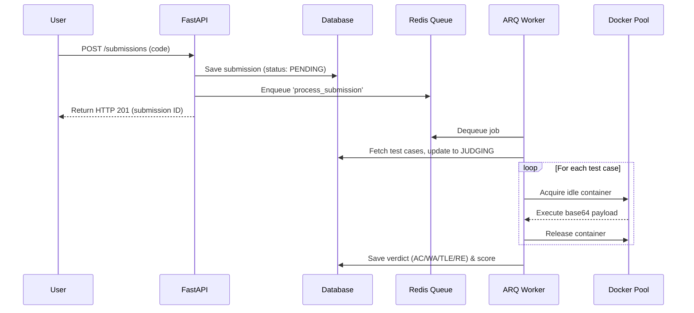

# Programming Bitcoin OJ Architecture

This document provides a comprehensive overview of the Online Judge (OJ) architecture, detailing the technology stack, data flow, scaling capabilities, and the rationale behind critical architectural decisions.

## 1. System Overview & Technology Stack

The system is a distributed, multi-language Online Judge designed to evaluate untrusted code against hidden test cases safely and concurrently.

- **Web Framework**: **FastAPI** (Python)
  - *Why*: Provides high-throughput async capabilities, automatic OpenAPI validation, and extremely low latency for I/O bound tasks (like waiting for database queries or enqueuing jobs).
- **Database**: **SQLite** (Async via `aiosqlite`) / **PostgreSQL**
  - *Why*: Currently using SQLite for ease of development, but built using SQLAlchemy's async ORM which makes migrating to a clustered PostgreSQL database trivial for production scaling.
- **Message Broker & Queue**: **Redis + ARQ**
  - *Why*: ARQ is a high-performance asyncio job queue backed by Redis. We chose ARQ over Celery because it perfectly integrates with FastAPI's async loops and has significantly less overhead.
- **Sandbox Engine**: **Docker API (docker-py)**
  - *Why*: Provides strong process isolation via Linux namespaces and cgroups. We use a persistent container pool to avoid the ~1-second penalty of spinning up new Docker containers for every submission.

---

## 2. Request Lifecycle & Data Flow

When a user submits code, the system processes it asynchronously to ensure the web server never blocks.



---

## 3. Key Architectural Decisions (The "Why")

### A. The Persistent Container Pool (`judge/pool.py`)
**Problem:** `docker run` takes 500ms to 1.5s to provision networking, mount file systems, and allocate cgroups. If we have 40 concurrent submissions, the server would spend minutes just spinning up containers.
**Solution:** We maintain a pool of long-running `sleep infinity` containers.
**Why:** When a job arrives, we use `docker exec` to run the payload inside an already-warm container. This reduces sandbox initialization latency from ~1000ms down to ~30ms.

### B. Async Message Queue (`ARQ`) vs Synchronous Execution
**Problem:** Code execution takes time (up to 5+ seconds per submission). If FastAPI waited for the result before responding, users would hold open HTTP connections, quickly exhausting server thread pools.
**Solution:** We decoupled the producer (FastAPI) and consumer (ARQ worker).
**Why:** The web server immediately returns a `201 Created` with a `PENDING` status. The frontend then polls (or uses websockets) for the result. This ensures the web UI remains instantly responsive regardless of queue length.

### C. Base64 Payload Injection
**Problem:** Injecting files into a running Docker container via `tar` archives often fails if the target directory is an isolated `tmpfs` (RAM disk), which we use to prevent disk I/O bottlenecks.
**Solution:** The ARQ worker wraps the user code, language, and test cases into a JSON payload, encodes it to Base64, and injects it via standard shell commands: `echo [base64] | base64 -d > /tmp/req.json && python3 run.py`.
**Why:** This is extremely fast, avoids Docker's archive API overhead, and works perfectly on in-memory `tmpfs` volumes.

### D. Per-Problem Memory Limits (`RLIMIT_AS`)
**Problem:** Docker containers are spun up in the persistent pool before we know which problem they will judge, meaning we can't set `mem_limit="256m"` globally if some problems need 512MB and others need 64MB.
**Solution:** The Docker container is given a large global limit (e.g., 2GB). Inside the container, the Python harness reads the specific problem's memory limit and uses `resource.setrlimit(resource.RLIMIT_AS, ...)` for Python/Rust, and `--max-old-space-size` for Node.
**Why:** This allows dynamic, granular memory limits per submission without having to tear down and recreate the Docker sandbox.

---

## 4. Scalability

The current architecture is designed for **Horizontal Scaling**. 

1. **Web Tier Scaling:** You can run multiple instances of the FastAPI server behind a load balancer (Nginx/HAProxy). They are entirely stateless.
2. **Worker Tier Scaling (Judging):** To process more concurrent submissions, you simply launch the ARQ worker on additional VMs. As long as they all point to the same Redis instance (`REDIS_URL`), they will naturally load-balance the judging queue.
3. **Sandbox Scaling:** The maximum concurrent jobs per worker is defined by `GLOBAL_MAX_MEMORY_MB`. By running the worker on a 64GB RAM instance, the system can maintain a pool of hundreds of concurrent Docker containers.
4. **Database:** SQLite is currently the bottleneck for high concurrency due to file locks. Moving to PostgreSQL will immediately resolve this and allow the platform to serve thousands of requests per second.

---

## 5. How to Run Locally

### Prerequisites
- Python 3.10+ (via Conda)
- Docker Desktop
- Redis Server (`brew install redis` or via docker)

### 1. Environment Setup
Create the Conda environment and install dependencies:
```bash
conda create -n bitcoin-oj python=3.10
conda activate bitcoin-oj
pip install -r backend/requirements.txt
```

### 2. Infrastructure
Start your local Redis instance:
```bash
redis-server --daemonize yes
```

Build the Docker sandbox runner image:
```bash
cd docker
docker build -t bitcoin-oj-runner -f Dockerfile.runner .
cd ..
```

### 3. Database Initialization
Wipe any old data and seed the database with problems, test cases, and admin users:
```bash
cd backend
rm -f judge.db
python seed.py
```

### 4. Start Services
You need to run two separate processes.

**Terminal 1 (Web API):**
```bash
conda activate bitcoin-oj
cd backend
uvicorn main:app --port 8001 --reload
```

**Terminal 2 (Judge Worker):**
```bash
conda activate bitcoin-oj
cd backend
arq worker.WorkerSettings
```

### 5. Access
- Web UI: Open `frontend/index.html` in your browser via a live server.
- API Docs: `http://localhost:8001/docs`
- Admin Login: `admin@example.com` / `admin1234`
